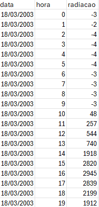

# Tutorial



O medias é um pacote simples formado por uma função apenas. Você precisar ter uma planilha no excel com datas, horas e valores de radiação- as colunas devem ter os seguintes nomes: data, hora e radiacao. A função então ira te retornar um dataframe com os valores das médias horárias baseada no conjunto de dados que você forneceu.
Um exemplo de planilha:

{ width="300" .center }